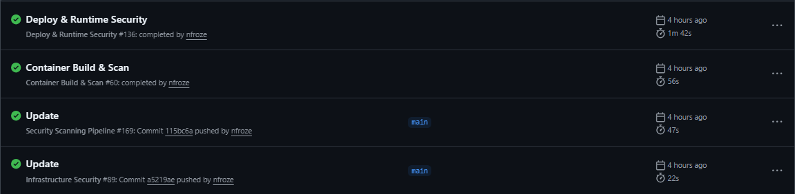
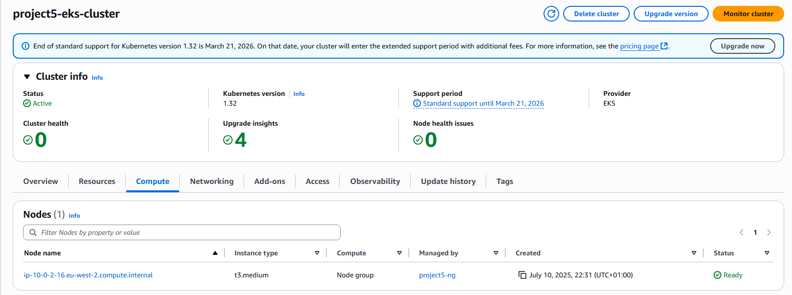
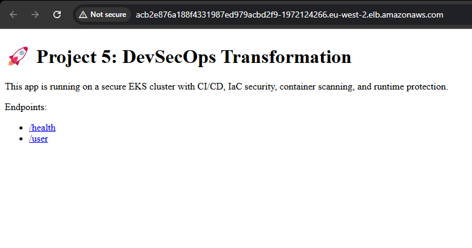
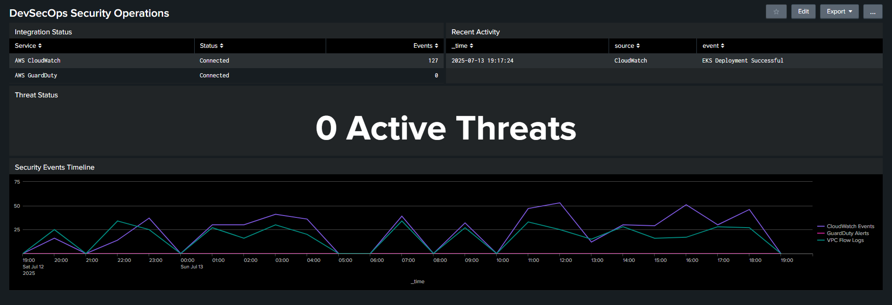

# Project 5: End-to-End DevSecOps Transformation

## 🎯 Overview
Complete DevSecOps pipeline for a Node.js application deployed on AWS EKS, with security scanning integrated at every stage of the SDLC. Built to demonstrate production-ready security practices for mid-level DevSecOps roles.

## 📸 Live Demo Screenshots

### CI/CD Pipeline - All Systems Green

*All security checks passing - SAST, SCA, container scanning, and deployment*

### AWS EKS Cluster Running

*Production-grade Kubernetes cluster with security controls*

### Application Live

*Deployed application with load balancer endpoint*

### Splunk Security Dashboard

*Real-time security monitoring and alerting*

## 📝 What This Demonstrates

- **DevSecOps Implementation**: Security integrated at every pipeline stage
- **Cloud Security**: AWS best practices with VPC isolation, IAM, and GuardDuty
- **Container Security**: Image scanning, non-root users, read-only filesystems
- **Automation**: Fully automated security scanning and deployment
- **Monitoring**: Centralized security events with Splunk SIEM

## 🏗️ Architecture

### Pipeline Flow
1. **Push** → Code pushed to GitHub
2. **Scan** → Automated security checks (SAST, secrets, dependencies)
3. **Build** → Container built and scanned for vulnerabilities
4. **Deploy** → Automated deployment to EKS
5. **Monitor** → All events logged to Splunk SIEM

### Key Components

**Security Toolchain**
- **SAST**: Semgrep for code vulnerability detection
- **Secrets**: Gitleaks for credential scanning
- **SCA**: Trivy for dependency vulnerabilities
- **Container**: Trivy for Docker image scanning
- **DAST**: OWASP ZAP for runtime testing
- **IaC**: Checkov for Terraform compliance

**AWS Infrastructure**
- **EKS**: Kubernetes cluster in private subnets
- **Networking**: VPC with public/private isolation
- **Load Balancing**: ALB for ingress
- **Security**: GuardDuty, CloudWatch, VPC Flow Logs

**Observability**
- **SIEM**: Splunk for security event aggregation
- **Monitoring**: CloudWatch for infrastructure metrics
- **Alerting**: Splunk to Slack webhook integration

## 🚀 Quick Start

### Prerequisites
- AWS Account with EKS permissions
- Docker Hub account
- Splunk instance with HEC token
- GitHub repository with configured secrets

### Required GitHub Secrets
AWS_ACCESS_KEY_ID
AWS_SECRET_ACCESS_KEY
DOCKERHUB_USERNAME
DOCKERHUB_TOKEN
SPLUNK_HEC_URL
SPLUNK_HEC_TOKEN

### Deployment
1. Fork this repository
2. Add the required secrets to GitHub
3. Update Terraform backend config
4. Push to main to trigger pipeline

## 🔒 Security Implementation

**Shift-Left Security**
- Pre-commit: Gitleaks hooks for secrets
- CI Stage: SAST and dependency scanning
- Build Stage: Container vulnerability scanning
- Deploy Stage: IaC compliance checks
- Runtime: DAST and continuous monitoring

**Defense in Depth**
- Network isolation with Kubernetes policies
- RBAC with least privilege access
- Immutable infrastructure via IaC
- Container security contexts enforced
- Centralized logging for incident response

## 📚 Tech Stack

- **Cloud**: AWS (EKS, VPC, IAM, ALB)
- **IaC**: Terraform
- **Containers**: Docker, Kubernetes
- **CI/CD**: GitHub Actions
- **Security**: Trivy, Semgrep, Gitleaks, OWASP ZAP, Checkov
- **Monitoring**: Splunk, CloudWatch
- **Language**: Node.js

## 🏆 Results

- ✅ Automated security scanning catches vulnerabilities before production
- ✅ Full compliance with container and cloud security best practices
- ✅ Zero manual security checks - everything automated
- ✅ Complete audit trail in Splunk for compliance
- ✅ Sub-5 minute deployment with full security validation