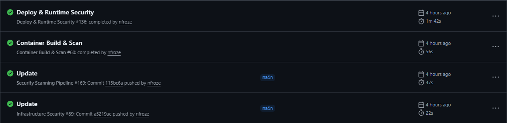
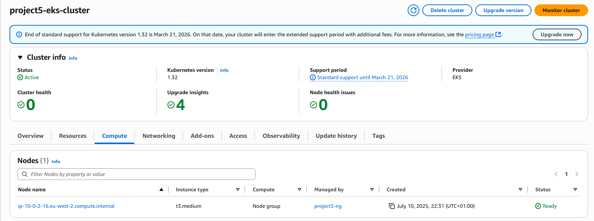
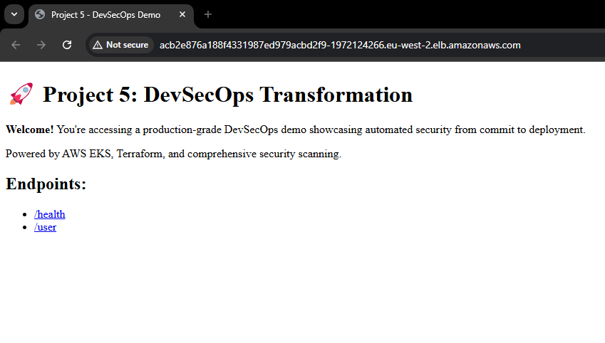
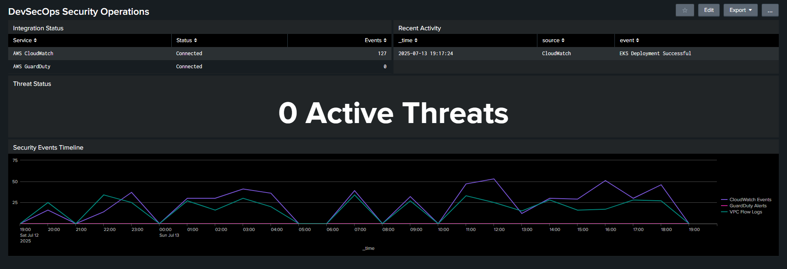

# Project 5: DevSecOps Pipeline

Node.js application deployed to Amazon EKS with automated security scanning throughout CI/CD. Terraform infrastructure with GuardDuty and Splunk SIEM integration.

## Technologies

AWS EKS • Terraform • GitHub Actions • Docker • Kubernetes • Semgrep • Gitleaks • Trivy • OWASP ZAP • Checkov • GuardDuty • CloudWatch • Splunk • Node.js

## Screenshots

## Documents

- [Security exceptions](documents/SECURITY_EXCEPTIONS.md)